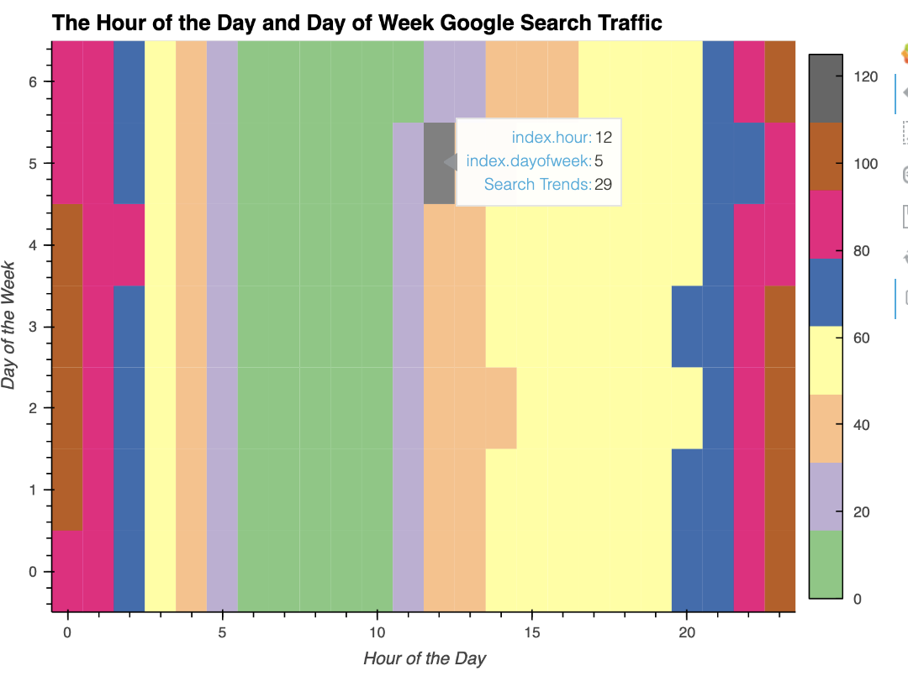
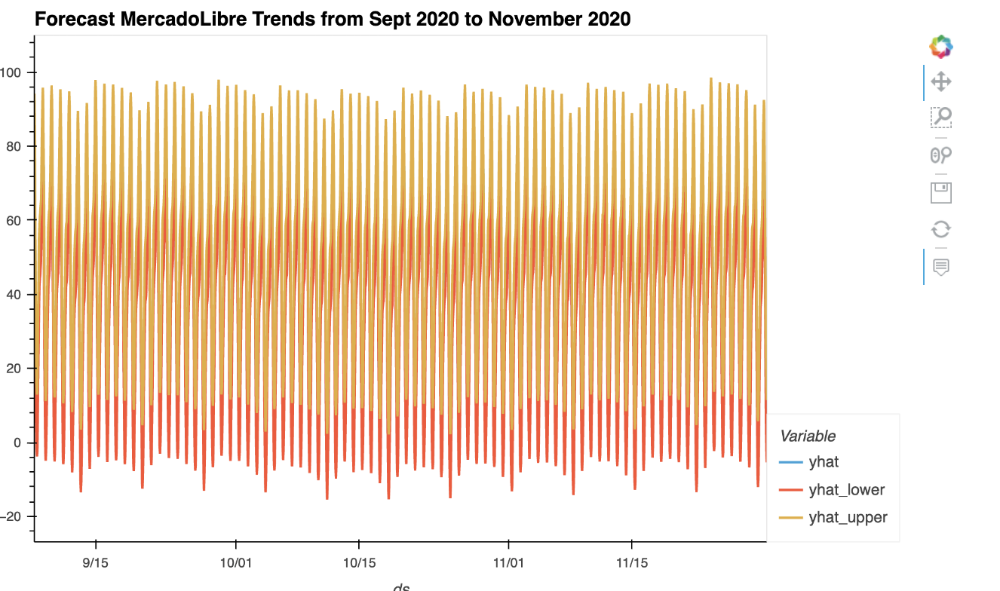
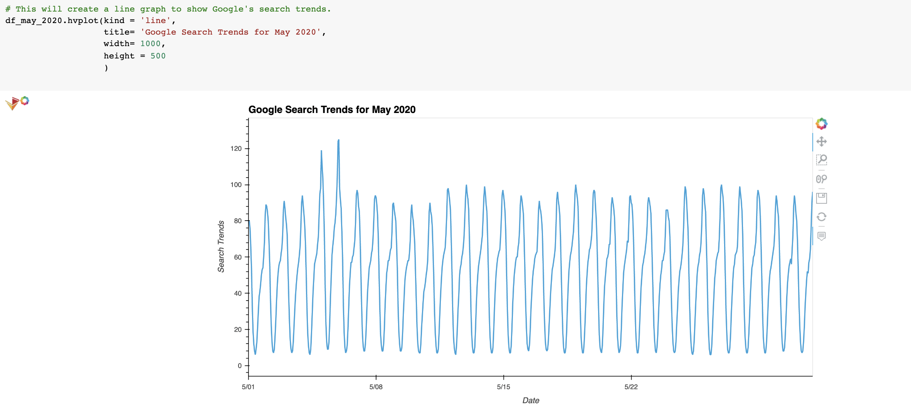
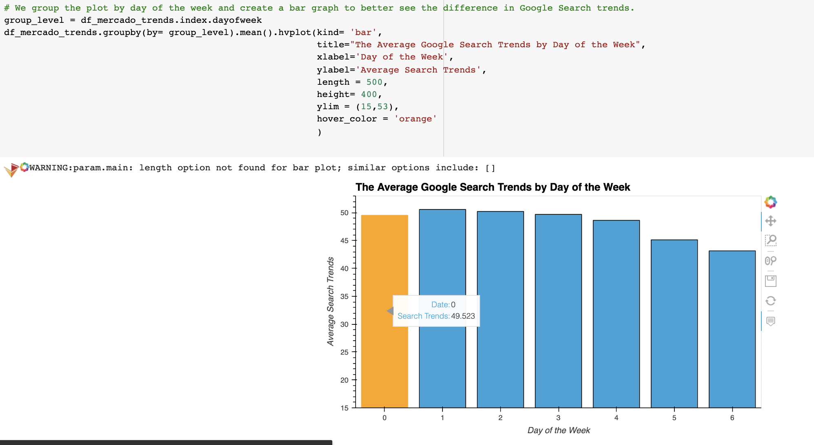
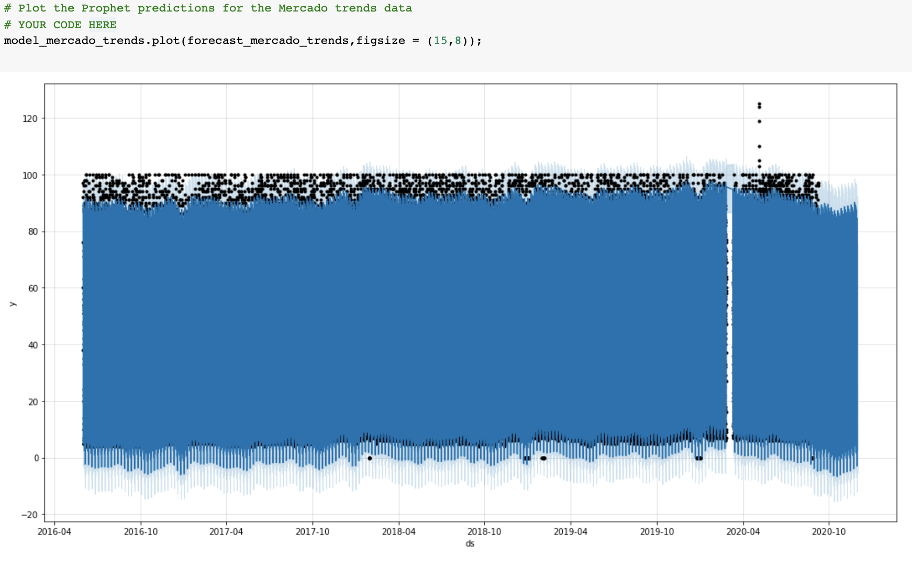
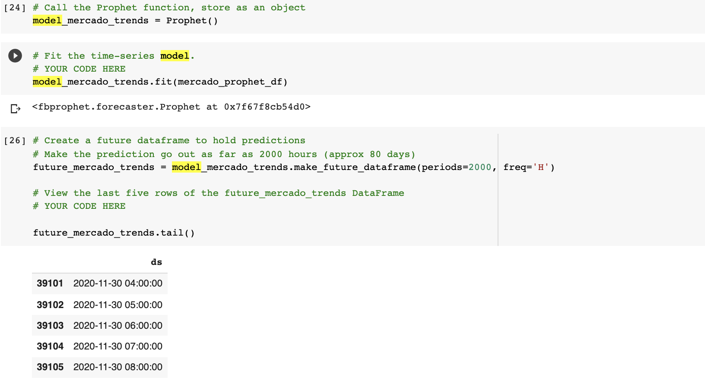

# **Forecasting Net Prophet**

## Overview

The Forecasting Net Prophet creates a forecast model of MercadoLibre stock prices, search trends as well as its sales revenues. To better understand how they affect the company as a whole. It uses FBProphet to create our modeling tool.

---

## Technologies

This project leverages **[python version 3.8.5](https://www.python.org/downloads/)** with the following packages and modules:

* [pandas](https://pandas.pydata.org/docs/) - This was used to be able to easily manipulate dataframes.

* [Jupyter Lab](https://jupyterlab.readthedocs.io/en/stable/) - This was used to be able to create and share documents that contain live code, equations, visualizations and narrative text.

* [PyVizlot](https://pyviz.org/) -  Python visualization package that provides a single platform for accessing multiple visualization libraries. Two of the libraries are:

    * [hvPlot](https://hvplot.holoviz.org/index.html) - *version  0.7.2* - This was used to be able to have an interactive plotting tool such as a line/bar graph and scatter plot.

* [Holoviews](https://holoviews.org/) - *verion 1.14.4* - This was used to design and make data analysis and visualization seamless and simple. 

* [FBProphet](https://facebook.github.io/prophet/) - This was used to create our forecasting time series model to be able as a way to predict our future dataframe.

* [Pystan](https://pystan.readthedocs.io/en/latest/) - This is a Python interface to Stan, a package for Bayesian inference.
---
## Installation Guide

Instead of our usual Jupyter Lab Notebook, we are using Google Colaboratory to open our iPython Notebook. The reason behind this is because our FBProphet is hard to install on some machines so we use Colaboratory to run our code while on the cloud.

### 1. Running Google Colaboratory

On your web browser,  copy and paste this link below: 

https://colab.research.google.com/notebooks/intro.ipynb?utm_source=scs-index#recent=true

There should be a pop-up allowing you to upload your ipynb file that is located on your local machine or from your Google Drive.

---

### 2. Installing the other platforms

 Since we are using Google Colaboratory, we are installing each our libraries while on the platform. This will allow the user to temporarily use the libraries while on the cloud. As you can see on gif below, it shows you that the installs are run, it will run during your Colab session.

---
## Examples

Here are some of the data visualization we did for this project.

 

 
 

---

## Usage

To be able to get a good analysis on the forecasting net prophet, we need to be able to model, fit and predict using our dataframe.

 

---

## Contributors

Contributed by: Justine Cho

Email: juz317_cho@yahoo.com

[ LinkedIn](https://www.linkedin.com/in/justinecho)

---

## License

### **MIT License**

Copyright (c) [2021] [Justine Cho]

Permission is hereby granted, free of charge, to any person obtaining a copy
of this software and associated documentation files (the "Software"), to deal
in the Software without restriction, including without limitation the rights
to use, copy, modify, merge, publish, distribute, sublicense, and/or sell
copies of the Software, and to permit persons to whom the Software is
furnished to do so, subject to the following conditions:

The above copyright notice and this permission notice shall be included in all
copies or substantial portions of the Software.

THE SOFTWARE IS PROVIDED "AS IS", WITHOUT WARRANTY OF ANY KIND, EXPRESS OR
IMPLIED, INCLUDING BUT NOT LIMITED TO THE WARRANTIES OF MERCHANTABILITY,
FITNESS FOR A PARTICULAR PURPOSE AND NONINFRINGEMENT. IN NO EVENT SHALL THE
AUTHORS OR COPYRIGHT HOLDERS BE LIABLE FOR ANY CLAIM, DAMAGES OR OTHER
LIABILITY, WHETHER IN AN ACTION OF CONTRACT, TORT OR OTHERWISE, ARISING FROM,
OUT OF OR IN CONNECTION WITH THE SOFTWARE OR THE USE OR OTHER DEALINGS IN THE
SOFTWARE.
